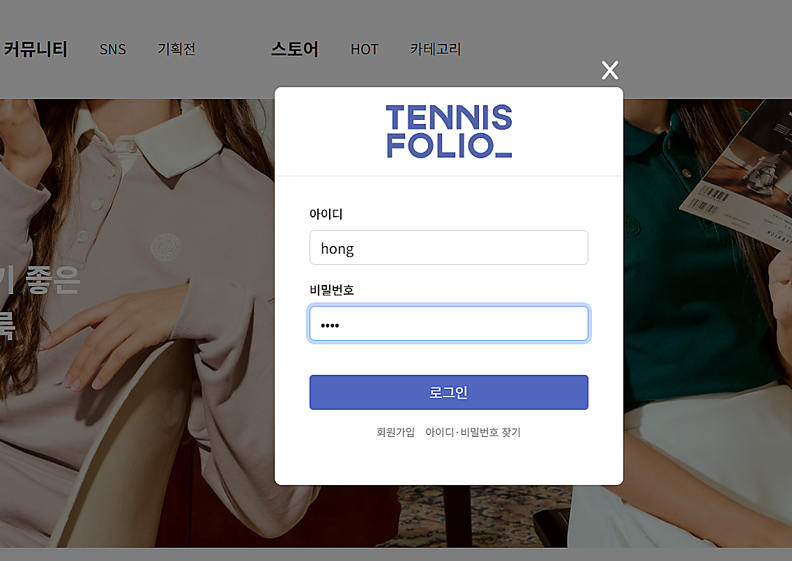
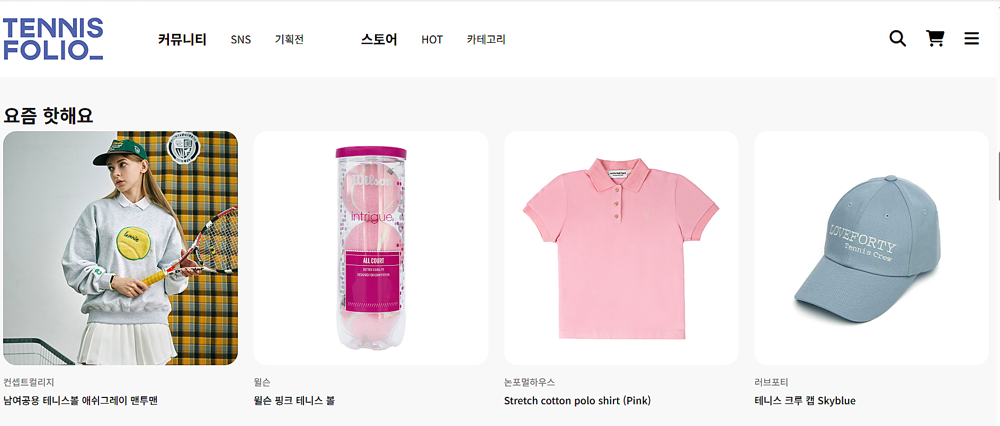
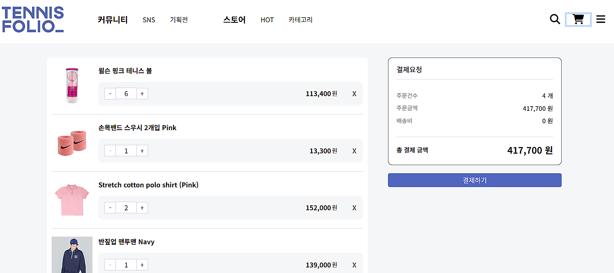
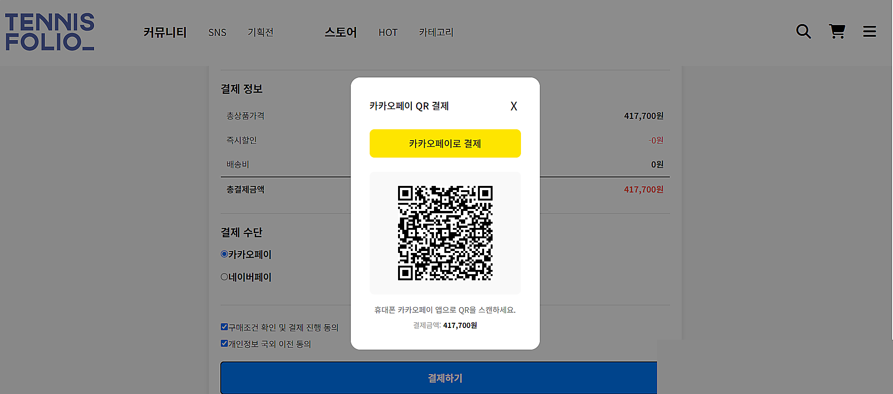
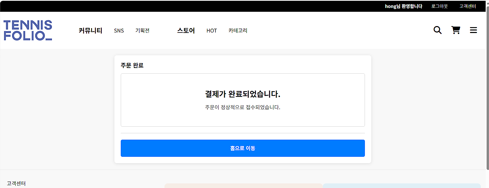

# 🎾 Tennis-Folio (테니스 전문 이커머스 플랫폼)

<div align="center">

**테니스 관련 상품을 전문으로 판매하는 팀 기반 이커머스 플랫폼**

<div>
  <a href="#-프로젝트-개요" style="display:inline-block;margin:4px 6px;padding:10px 16px;border-radius:999px;background:#1db954;color:#fff;text-decoration:none;font-weight:600;font-size:0.96rem;">프로젝트 개요</a>
  <a href="#-주요-기능" style="display:inline-block;margin:4px 6px;padding:10px 16px;border-radius:999px;background:#2196f3;color:#fff;text-decoration:none;font-weight:600;font-size:0.96rem;">주요 기능</a>
  <a href="#-기술-스택" style="display:inline-block;margin:4px 6px;padding:10px 16px;border-radius:999px;background:#ff9800;color:#fff;text-decoration:none;font-weight:600;font-size:0.96rem;">기술 스택</a>
  <a href="#-프로젝트-구조" style="display:inline-block;margin:4px 6px;padding:10px 16px;border-radius:999px;background:#9c27b0;color:#fff;text-decoration:none;font-weight:600;font-size:0.96rem;">구조</a>
  <a href="#-설치-및-실행" style="display:inline-block;margin:4px 6px;padding:10px 16px;border-radius:999px;background:#e91e63;color:#fff;text-decoration:none;font-weight:600;font-size:0.96rem;">설치 및 실행</a>
</div>

</div>

---

## 📋 프로젝트 개요

Tennis-Folio는 테니스 장비, 의류, 액세서리를 판매하는 종합 이커머스 플랫폼입니다.  
팀 프로젝트로 진행되었으며, **MVC 아키텍처**를 기반으로 클라이언트와 서버가 RESTful API로 통신합니다.

**프로젝트 기간:** 10일 (팀 프로젝트)  
**팀 규모:** 4인 팀 프로젝트

---

## 🛠 주요 기능 및 구현 내용

### 1️⃣ **Hot Products 컴포넌트**

<sub>Frontend: React | Backend: Node.js/Express | Database: MySQL</sub>

#### 📌 구현 내용

- **SQL 테이블 통합 관리**: `best_product` 테이블의 `category_id = 8`을 활용하여 bestProduct와 hotProduct를 동일 테이블에서 관리
- **카테고리 기반 필터링**: Category ID를 통한 유연한 데이터 조회로 확장성 확보
- **Axios 기반 데이터 로드**: 동적 데이터 페칭 및 에러 처리

#### 🔧 기술 스택

| 계층         | 기술                                            |
| ------------ | ----------------------------------------------- |
| **Frontend** | React, Axios, useState/useEffect Hooks          |
| **Backend**  | Node.js, Express.js, Controller-Repository 패턴 |
| **Database** | MySQL (SQL 쿼리 최적화)                         |

### 2️⃣ **장바구니 로직 (Shopping Cart)**

<sub>Frontend: React | Backend: Node.js/Express | Database: MySQL</sub>

#### 📌 구현 기능

- ✅ **상품 추가**: 동일 상품의 중복 추가 시 수량 증가 로직
- ✅ **수량 관리**: 증감 버튼으로 실시간 수량 변경
- ✅ **상품 삭제**: 개별 및 일괄 삭제 기능
- ✅ **총액 계산**: 상품별 수량 × 가격으로 자동 계산
- ✅ **상태 동기화**: 프론트엔드와 백엔드 상태 실시간 동기화

#### 🏗 MVC 기반 아키텍처

```
Routes (API 엔드포인트)
    ↓
Controller (비즈니스 로직)
    ↓
Repository (데이터 접근)
    ↓
Database (MySQL)
```

#### 📊 API 엔드포인트

| 메서드   | 엔드포인트      | 기능                 |
| -------- | --------------- | -------------------- |
| **POST** | `/carts/add`    | 장바구니에 상품 추가 |
| **POST** | `/carts/update` | 수량 변경            |
| **POST** | `/carts/delete` | 상품 삭제            |
| **GET**  | `/carts/list`   | 장바구니 목록 조회   |

### 3️⃣ **카카오페이 결제 API 연동**

<sub>Frontend: React | Backend: Node.js/Express | External API: KakaoPay</sub>

#### 📌 결제 프로세스

```
1. Ready 단계 (결제 준비)
   ↓ (사용자가 결제 진행)
2. Approve 단계 (결제 승인)
   ↓ (PG Token 수신)
3. Redirect (성공 페이지로 이동)
```

#### 🔐 API 호출 흐름

| 단계        | 설명                          | 반환값                            |
| ----------- | ----------------------------- | --------------------------------- |
| **Ready**   | KakaoPay API에 결제 준비 요청 | `tid`, `next_redirect_mobile_url` |
| **Approve** | PG Token을 이용한 최종 승인   | 결제 정보, redirect               |
| **Status**  | 결제 상태 조회                | `ready`, `approved`               |

#### (코드 예시는 생략)

#### 🔑 주요 구현 특징

- **외부 URL 터널링**: ngrok을 통해 로컬 서버를 외부에 노출
- **TID 저장소**: 승인 단계에서 필요한 tid를 메모리 객체에 저장
- **에러 처리**: KakaoPay API 실패 시 상세 에러 메시지 반환
- **보안**: SECRET_KEY를 환경 변수로 관리

---

## 🛠 기술 스택

### Frontend

- **React.js** - UI 컴포넌트 라이브러리
- **React Router** - 클라이언트 라우팅
- **Axios** - HTTP 클라이언트
- **Bootstrap** - CSS 프레임워크
- **Zustand** - 상태 관리 (인증 정보)

### Backend

- **Node.js** - 런타임 환경
- **Express.js** - 웹 프레임워크
- **MySQL** - 데이터베이스
- **mysql2/promise** - MySQL 드라이버
- **dotenv** - 환경 변수 관리

### DevOps

- **ngrok** - 로컬 서버 외부 노출 (카카오페이 테스트)
- **Vite** - 프론트엔드 번들러

---

## ⚙️ 아키텍처 요약 및 실행 방법 (프론트엔드 + 서버 + DB)

이 리포지토리는 주어진 프론트엔드 코드에 별도의 Express 서버와 MySQL 데이터베이스를 붙여 동작하도록 구성한 결과물입니다. 프론트엔드는 기존의 정적 코드에서 Axios 기반 비동기 요청으로 변경되어, 백엔드 API와 통신합니다.

- **프론트엔드 폴더:** [tennisfolio-front](tennisfolio-front)
- **백엔드 폴더:** [tennisfolio-server](tennisfolio-server)
- **DB 덤프 파일:** [tennisfolio_dump.sql](tennisfolio_dump.sql), [tennisfolio_dump-2.sql](tennisfolio_dump-2.sql)
- **DB 연결 설정 파일:** [tennisfolio-server/DB/connection.js](tennisfolio-server/DB/connection.js)

핵심 포인트:

- 프론트엔드는 `src/util/dataAxios.js`에서 `http://localhost:4000`을 기본 URL로 사용하는 헬퍼를 제공하여, 모든 백엔드 호출을 포워딩합니다.
- Vite 개발 서버는 `/api` 경로를 프록시하도록 설정되어 있어 일부 API는 프록시를 통해 전달됩니다. 프록시 설정: [tennisfolio-front/vite.config.js](tennisfolio-front/vite.config.js)
- 서버는 `tennisfolio-server/app.js`에서 여러 라우트를 마운트합니다 (예: `/carts`, `/login`, `/signup`, `/api/hot`, `/api/best`, `/kakao` 등).

간단 실행 가이드

1. MySQL 데이터베이스 준비

```bash
# (예시) 로컬 MySQL에 데이터베이스 생성 및 덤프 임포트
mysql -u root -p -e "CREATE DATABASE IF NOT EXISTS tennisfolio;"
mysql -u root -p tennisfolio < tennisfolio_dump.sql
```

2. 백엔드 실행

```bash
cd tennisfolio-server
npm install
# 환경변수 파일(.env)에 DB_HOST, DB_USER, DB_PASSWORD, DB_NAME 등을 설정합니다.
# 예: DB_HOST=localhost DB_USER=root DB_PASSWORD=yourpw DB_NAME=tennisfolio
npm run start
```

3. 프론트엔드 실행

```bash
cd tennisfolio-front
npm install
npm run dev
```

주의사항 및 참고

- DB 연결 정보는 [tennisfolio-server/DB/connection.js](tennisfolio-server/DB/connection.js)에서 환경변수를 통해 설정됩니다. 기본값으로 RDS 호스트와 기본 DB명을 사용하도록 되어 있으니 로컬에서 사용할 경우 `.env`에 값을 덮어쓰세요.
- 프론트엔드의 Axios 호출 헬퍼는 [tennisfolio-front/src/util/dataAxios.js](tennisfolio-front/src/util/dataAxios.js)입니다. 이 헬퍼는 `http://localhost:4000`을 사용하므로, 백엔드가 다른 호스트/포트에 있다면 변경해야 합니다.
- 서버는 CORS를 허용하도록 설정되어 있어, 프론트엔드가 직접 `http://localhost:4000`로 요청을 보내도 동작합니다.

더 필요한 문서(예: 각 API 엔드포인트 상세 명세, DB 스키마 ERD)를 원하시면 알려주세요. 원하시면 README에 API 목록을 자동으로 생성해 추가하겠습니다.

## 📁 프로젝트 구조

```
tennis-folio-project/
│
├── tennisfolio-front/          # 프론트엔드 (React)
│   ├── src/
│   │   ├── component/
│   │   │   ├── Hot.jsx         # 🔴 Hot Products 컴포넌트
│   │   │   ├── Cart.jsx        # 🔴 장바구니 컴포넌트
│   │   │   ├── Checkout.jsx    # 결제 페이지
│   │   │   └── PaymentSuccess.jsx
│   │   ├── util/
│   │   │   └── cart.js         # 🔴 장바구니 유틸리티 함수
│   │   └── store/
│   │       └── useAuthStore.js # Zustand 상태 관리
│   └── package.json
│
├── tennisfolio-server/         # 백엔드 (Node.js/Express)
│   ├── controller/
│   │   ├── hot.js              # 🔴 Hot Products 컨트롤러
│   │   ├── carts.js            # 🔴 장바구니 컨트롤러
│   │   └── kakao.js            # 🔴 카카오페이 컨트롤러
│   ├── repository/
│   │   ├── hot.js              # 🔴 Hot Products 데이터 접근
│   │   └── carts.js            # 🔴 장바구니 데이터 접근
│   ├── routes/
│   │   ├── hot.js
│   │   ├── carts.js
│   │   └── kakao.js            # 🔴 카카오페이 라우트
│   ├── DB/
│   │   └── connection.js       # MySQL 커넥션
│   ├── app.js                  # Express 설정
│   └── package.json
│
└── README.md
```

🔴 = 주요 구현 담당 파일

---

## 💡 핵심 기술 포인트

### 1. **SQL 최적화 & 테이블 설계**

- Category ID를 활용한 효율적인 데이터 분류
- JOIN 쿼리 대신 단일 테이블에서 필터링으로 쿼리 성능 최적화
- VIEW를 활용한 복잡한 조인 쿼리 단순화

### 2. **MVC 패턴 구현**

- **Controller**: 요청 처리 및 응답 반환
- **Repository**: 데이터베이스 쿼리 로직 분리
- **Routes**: API 엔드포인트 정의
- 계층 분리로 코드 유지보수성 및 테스트 용이성 향상

### 3. **비동기 처리 (async/await)**

- 데이터베이스 쿼리의 논블로킹 처리
- Axios를 통한 클라이언트 사이드 비동기 데이터 로드
- 결제 API 호출 시 정확한 타이밍 제어

### 4. **보안**

- 환경 변수를 통한 민감한 정보 관리 (.env)
- SQL 파라미터화를 통한 SQL Injection 방지
- 결제 tid 저장소를 통한 트랜잭션 무결성

### 5. **상태 관리**

- React Hooks (useState, useEffect)로 컴포넌트 상태 관리
- 서버 상태와 클라이언트 상태 동기화
- Zustand를 통한 전역 상태 관리 (인증)

---

## 🚀 설치 및 실행

### 사전 요구사항

- Node.js (v14 이상)
- MySQL (v5.7 이상)
- npm 또는 yarn

### 데이터베이스 설정

```bash
# MySQL에 데이터베이스 생성
mysql -u root -p < tennisfolio_dump.sql
```

### 백엔드 실행

```bash
cd tennisfolio-server

# 의존성 설치
npm install

# .env 파일 설정
# .env 파일에 다음 내용 추가:
# Kakao_Secret_KEY=your_kakao_secret_key
# DB_HOST=localhost
# DB_USER=root
# DB_PASSWORD=your_password
# DB_NAME=tennisfolio

# 서버 시작
npm start
```

### 프론트엔드 실행

```bash
cd tennisfolio-front

# 의존성 설치
npm install

# 개발 서버 시작
npm run dev
```

### 카카오페이 테스트 (ngrok)

```bash
# ngrok 다운로드 및 로컬 서버 노출
ngrok http 5000

# 출력된 URL을 카카오페이 승인 URL에 설정
```

---

## 📊 성과 및 배운 점

### ✅ 성공적으로 구현된 기능

- ✅ Hot Products 동적 데이터 로딩 및 렌더링
- ✅ 장바구니 CRUD 작업 (Create, Read, Update, Delete)
- ✅ 카카오페이 Ready → Approve → Redirect 전체 결제 흐름
- ✅ MVC 아키텍처를 통한 체계적인 코드 구조

### 🎓 핵심 학습 포인트

1. **REST API 설계**: 명확한 엔드포인트와 HTTP 메서드 사용
2. **데이터베이스 쿼리 최적화**: 카테고리 기반 필터링으로 성능 향상
3. **외부 API 연동**: KakaoPay API를 통한 실제 결제 프로세스 구현
4. **팀 협업**: 백엔드-프론트엔드 간 명확한 API 문서화 및 의사소통

---

## 📝 라이센스

이 프로젝트는 학습 목적의 팀 프로젝트입니다.

---

**작성일:** 2026년  
**개발자:** Tennis-Folio 팀  
**역할:** Hot Products 컴포넌트 개발 | 장바구니 로직 구현 | 카카오페이 API 연동

## 📱 시연 스크린샷

<p align="center">
  
  
  
  
</p>

<p align="center">
  
  
</p>
